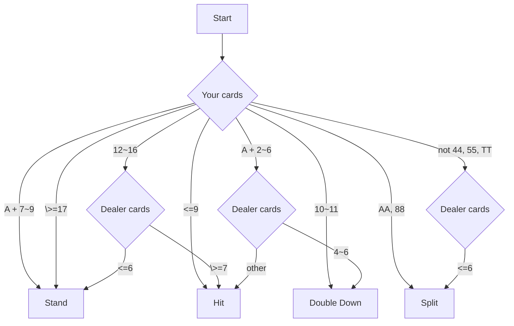

# Decision Tree for Simplified Basic Strategy S17 table

```mermaid
flowchart TD
    S[Start] --> playerCards{Your cards}

    playerCards --> |A + 7~9| stand
    playerCards --> |\>=17| stand
    playerCards --> |12~16| delarCards{Dealer cards}
    playerCards --> |10~11| doubleDown[Double Down]
    playerCards --> |<=9| hit[Hit]
    playerCards --> |AA, 88| split[Split]
    playerCards --> |not 44, 55, TT| delarCards3{Dealer cards}

    playerCards --> |A + 2~6| delarCards2{Dealer cards}

    delarCards --> | <=6| stand[Stand]
    delarCards --> | \>=7| hit[Hit]
    delarCards2 --> |4~6| doubleDown[Double Down]
    delarCards2 --> |other| hit[Hit]
    delarCards3 --> |<=6| split[Split]
```

Source: https://www.blackjackapprenticeship.com/blackjack-strategy-charts/