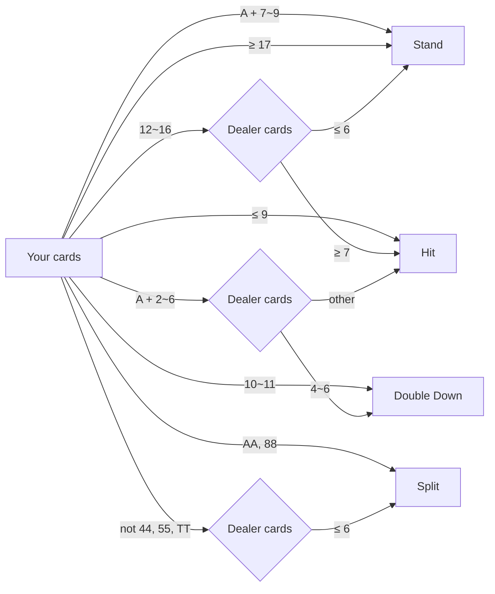
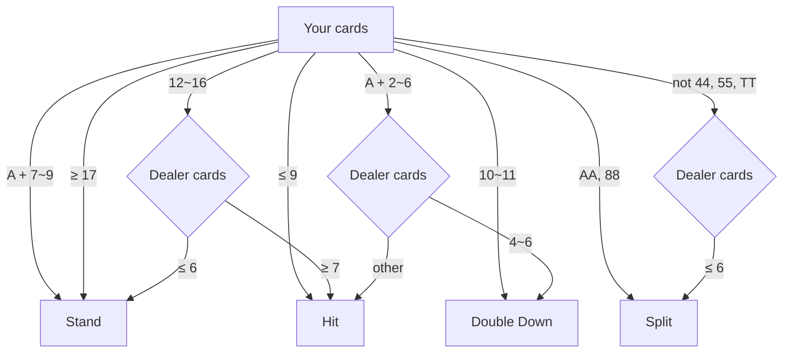

# Decision Tree for Simplified Basic Strategy S17 table

# vertical mode

```mermaid
flowchart LR
    playerCards[Your cards]

    playerCards --> |A + 7~9| stand
    playerCards --> | ≥ 17| stand
    playerCards --> |12~16| delarCards{Dealer cards}
    playerCards --> |10~11| doubleDown
    playerCards --> |≤ 9| hit
    playerCards --> |AA, 88| split
    playerCards --> |not 44, 55, TT| delarCards3{Dealer cards}

    playerCards --> |A + 2~6| delarCards2{Dealer cards}

    delarCards --> | ≤ 6| stand
    delarCards --> | ≥ 7| hit
    delarCards2 --> |4~6| doubleDown
    delarCards2 --> |other| hit
    delarCards3 --> |≤ 6| split

    stand[Stand]
    hit[Hit]
    doubleDown[Double Down]
    split[Split]
```

# horizontal mode

```mermaid
flowchart TB
    playerCards[Your cards]

    playerCards --> |A + 7~9| stand
    playerCards --> | ≥ 17| stand
    playerCards --> |12~16| delarCards{Dealer cards}
    playerCards --> |10~11| doubleDown
    playerCards --> |≤ 9| hit
    playerCards --> |AA, 88| split
    playerCards --> |not 44, 55, TT| delarCards3{Dealer cards}

    playerCards --> |A + 2~6| delarCards2{Dealer cards}

    delarCards --> | ≤ 6| stand
    delarCards --> | ≥ 7| hit
    delarCards2 --> |4~6| doubleDown
    delarCards2 --> |other| hit
    delarCards3 --> |≤ 6| split

    stand[Stand]
    hit[Hit]
    doubleDown[Double Down]
    split[Split]
```

Source: https://www.blackjackapprenticeship.com/blackjack-strategy-charts/